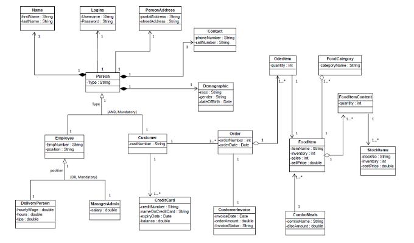

# gxs-sentiment-analysis
This project gauges customer sentiments towards the bank’s services using advanced natural language processing techniques.

## Introduction
We are a group of students from National University of Singapore taking DSA3101 doing a customer feedback sentiment analysis project for GXS Bank. Using advanced Natural Language Processing (NLP) techniques such as Large Language Models (LLMs), we analyzed customer reviews from Google Play Store and Apple Store to help GXS understand and improve customer satisfaction.

## Key features
* Customizable Filters: Filter data by sentiment, service, and issue to focus on specific insights.
* Competitor Analysis: Compare sentiment trends with competitors to benchmark performance.
* Actionable Insights: Receive recommendations for improving customer experience based on sentiment analysis.

## Architecture 

## Installation 

### Data Mining Pipepine

##### 1. ensure pipenv is installed: https://pipenv.pypa.io/en/stable/index.html
    pip install --user pipenv

##### 2. install requirements
    cd .\backend && pipenv install

##### 3. download model
    pipenv run huggingface-cli download TheBloke/Mistral-7B-Instruct-v0.2-GGUF mistral-7b-instruct-v0.2.Q5_K_M.gguf --local-dir .\model --local-dir-use-symlinks False

OPTIONAL if you want a more sandbox environment to play around: 
##### start jupyterlab
    pipenv run python -m jupyterlab
##### start local inference server
    pipenv run python -m llama_cpp.server --model .\model\mistral-7b-instruct-v0.2.Q5_K_M.gguf

### Web Application
### 1. Install manually
##### Step 1: Install dependencies in requirement.txt
    pip install -r requirement.txt
##### Step 2: cd to backend/server directory
    cd backend/server
##### Step 3: start flask server
    python main.py
##### Step 4: cd to frontend/ directory
    cd frontend/
##### Step 5: Install frontend dependencies
    npm install
##### Step 6: Start to react server
    npm start
##### Step7: Access the web application at:
    http://localhost:3000
##### Optional: if using other web servers (Nginx), build the frontend by:
    npm build
### 2. Install with container
##### Start [docker desktop](https://www.docker.com/products/docker-desktop/) and run:
    docker-compose up --build
##### Access the web application at
    http://localhost

## Documentation
* Wiki Page: https://docs.google.com/document/d/1cYT9Ljt-SsauDqnpxowzce_r4Xhp_ljDl60fP2XdjmM/edit
* Technical Handover: https://docs.google.com/document/d/1wqhj5kz9XdS5hioQPgAznluJ-uNrKReKkUuNyCnAoPM/edit

## Contributors 
- *Caleb Lee Heng Yi* (Frontend)
- *Cheryl Tan Geok Ching* (Frontend)
- *Lim Jing Rui* (Backend)
- *Ng Elangel* (Frontend)
- *Ng Keen Yung* (Backend)
- *Sarah Goh Yue En* (Backend)
- *Shi Shuangqi* (Backend)
- *Wang Jianing* (Frontend)

## Supervisor
- Prof *Hernandez Marin Sergio*

## Industrial partner
- GXS Bank Singapore (https://www.gxs.com.sg/)
